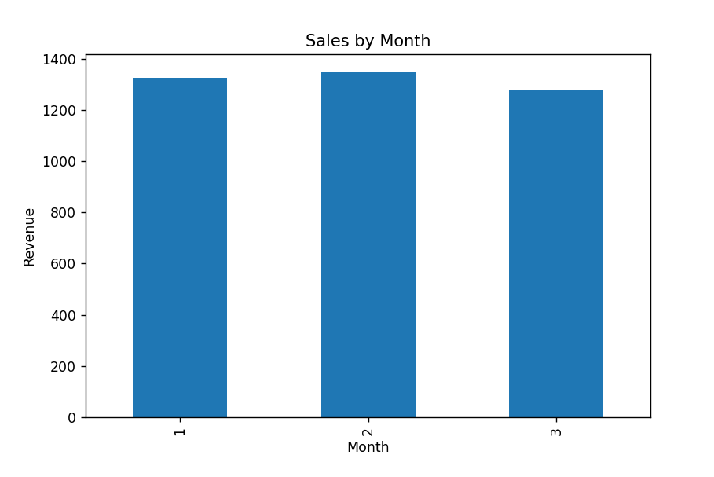
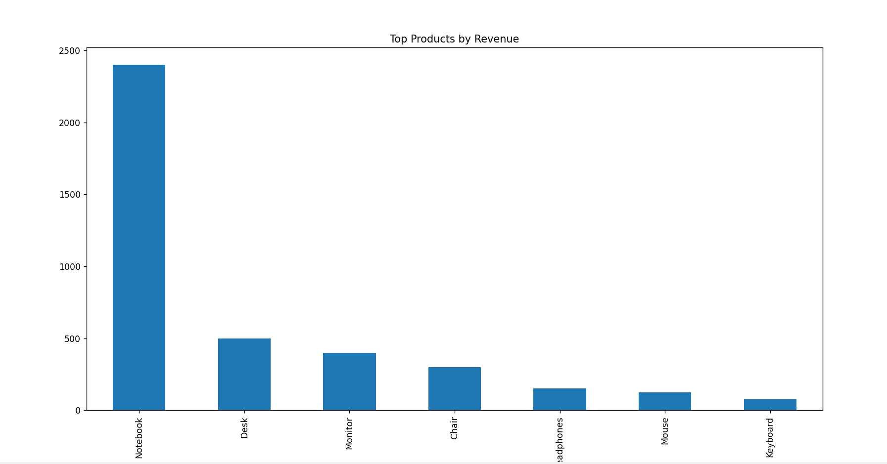

# 🛒 E-commerce Sales Data Analysis

This project analyzes sales data from an e-commerce dataset.

## 📊 Objectives
- Calculate total revenue
- Identify top-selling products
- Analyze sales trends over time

## 🛠 Tools
- Python
- Pandas
- Matplotlib

## 📈 Insights
- Electronics products generated the highest revenue
- Sales increased in March
- Some customers purchased more frequently

## 📊 Business Questions

- What is the total revenue?
- Which products generate the most sales?
- How do sales change over time?

## 📈 Key Insights

- Electronics generate the highest revenue
- March had the highest sales
- Repeat customers contribute significantly to revenue

## 🚀 How to Run
```bash
python analysis.py

## 📊 Sales by Month

This chart shows how revenue changes over time.

💡 Insight:
Sales increased in March, indicating a possible growth trend or seasonal demand.



## 🛒 Top Products

This chart shows which products generate the most revenue.

💡 Insight:
Electronics products are the top contributors to revenue, especially notebooks and accessories.


